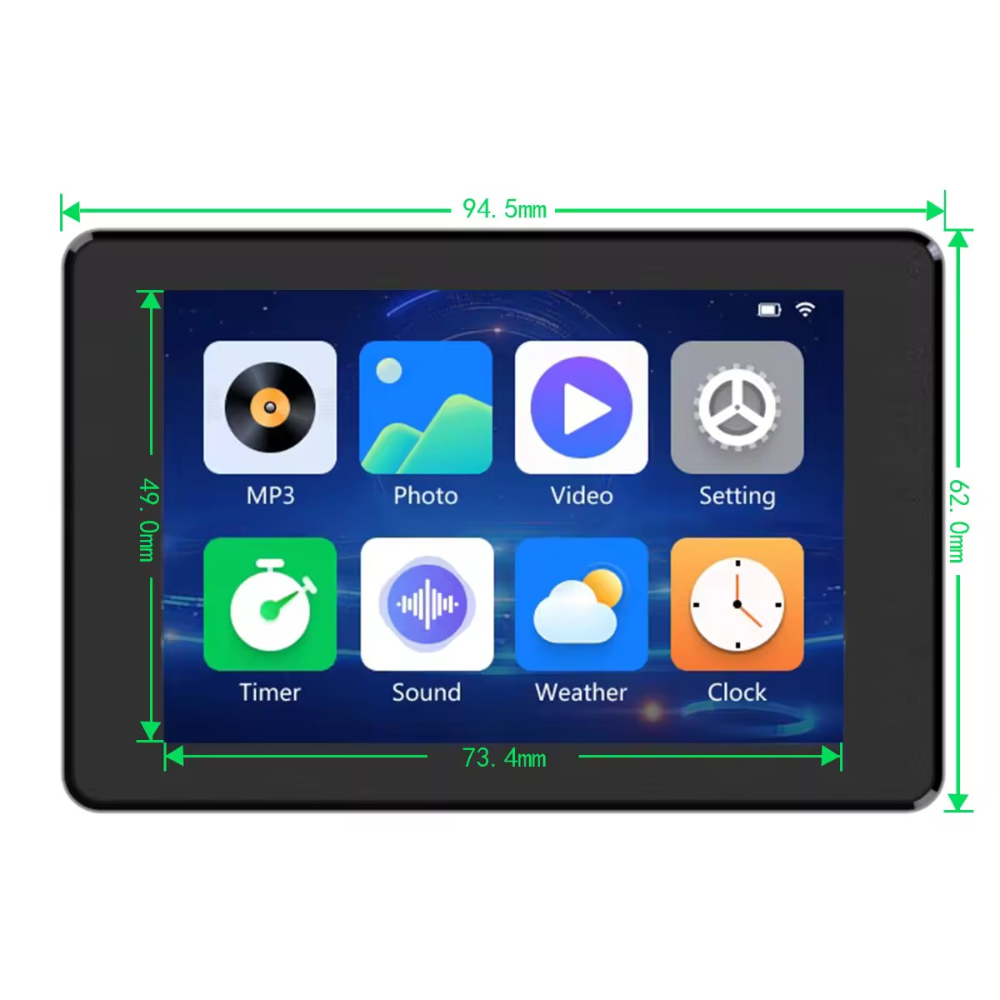
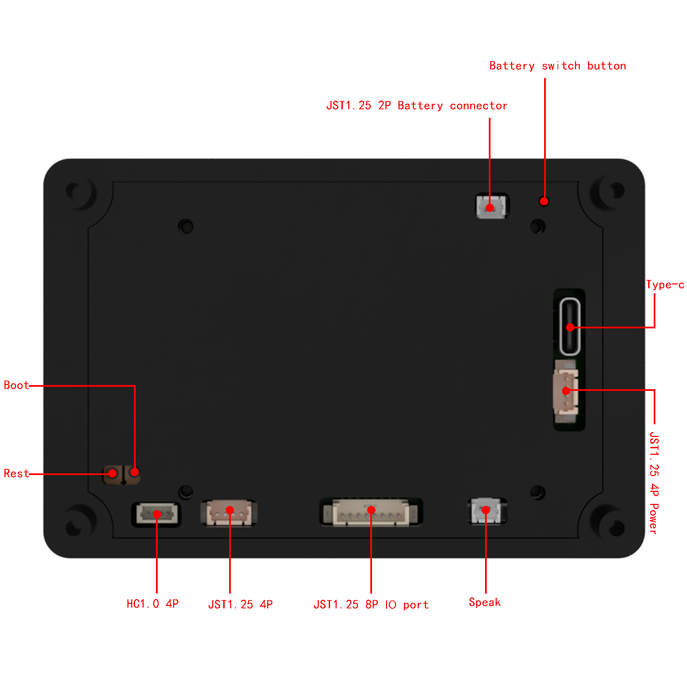
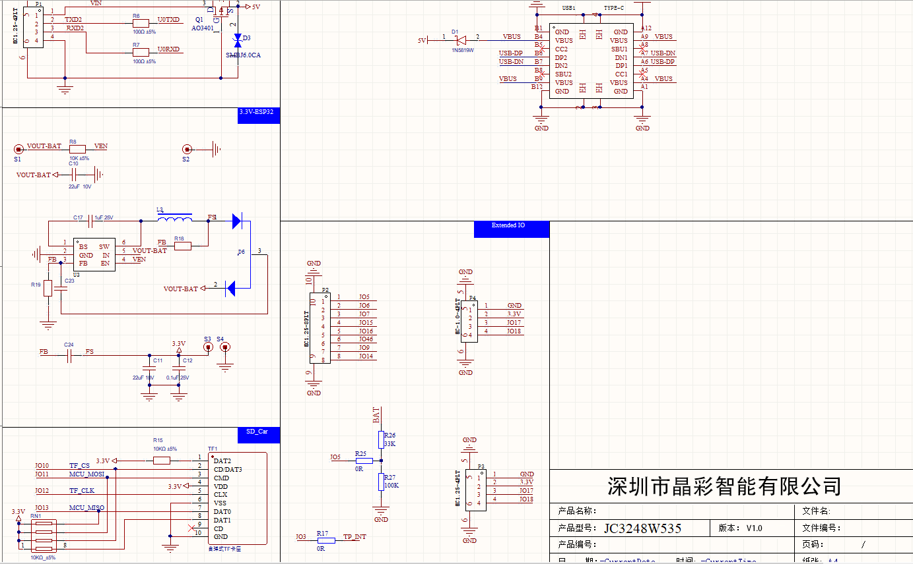
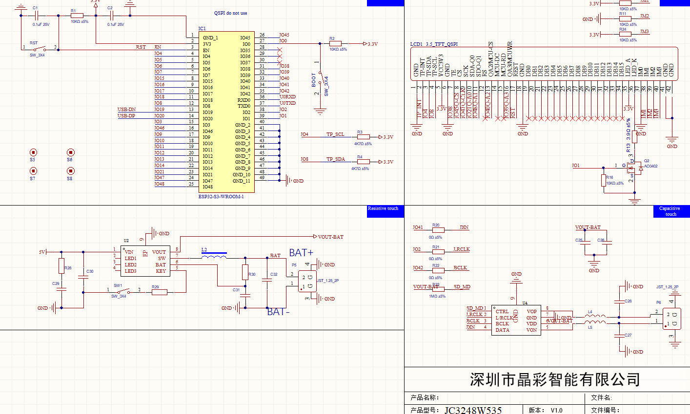

# JC3248W535

## Hardware Settings

This section provides guidance on configuring hardware settings for optimal performance and reliability.

### Arduino

* Board: ESP32S3 Dev Module
* USB CDC On Boot: Enabled
* Flash Mode: QIO 120MHz
* Flash Size: 16MB (128Mb)
* Partition Scheme: Huge APP (3MB No OTA/1MB SPIFFS)
* PSRAM: OPI PSRAM

## Structure Diagram
* Front: 
* Back: 
* IO pin #1: 
* IO pin #2: 
